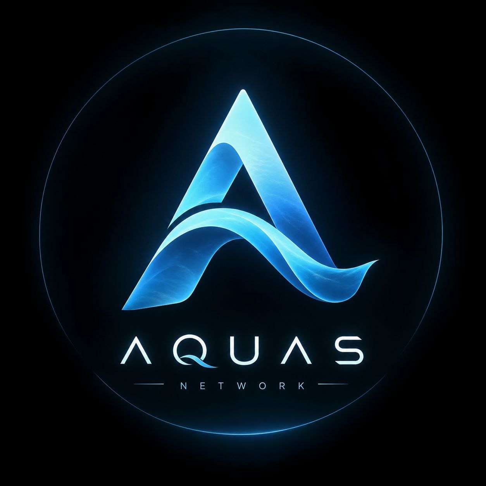
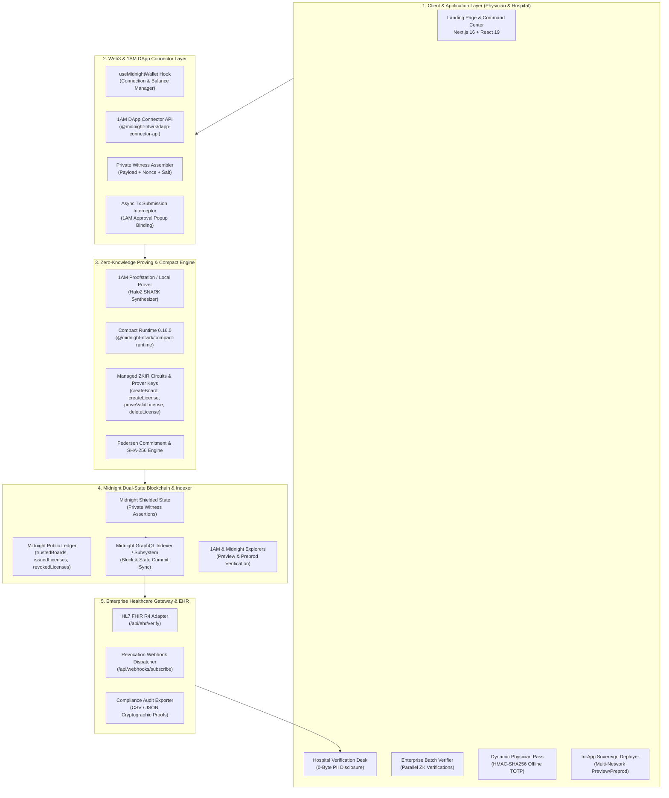

<div align="center">
  <a href="https://aquas.health">
    
  </a>
  <br>

  # AQUAS: Zero-Knowledge Medical License Registry
  
  **Enterprise-grade cryptographic privacy and instant verification for doctors, state licensing boards, and healthcare institutions.**
  
  <i>Confidential medical license verification, sovereign clinical identity, and real-time sanction sentinels powered by Midnight zero-knowledge cryptography.</i>
  <br><br>

  [](https://github.com/Saimand07/Aquas/actions/workflows/CI.yml)
  [](https://opensource.org/licenses/MIT)
  [](https://midnight.network/)
  [](./contracts)
  [](https://nextjs.org/)
  [](https://1am.xyz)
  [](https://x.com/AquasNtwrk)
  [](https://x.com/AquasNtwrk/status/2101953358030307444)
  [](#)
  <br><br>

  
</div>

> 🎬 **Demo Video:** [https://youtu.be/WOtCmrVp94g](https://youtu.be/WOtCmrVp94g)  
> 🌐 **Live Application:** [https://license-seal-sigma.vercel.app/](https://license-seal-sigma.vercel.app/)  
> 📄 **Product Proposal & Specification:** [Read Approved Idea Proposal (proposals.md)](./proposals.md)  
> 💻 **GitHub Repository:** [https://github.com/Saimand07/Aquas](https://github.com/Saimand07/Aquas)  
> 🐦 **Official X (Twitter):** [https://x.com/AquasNtwrk](https://x.com/AquasNtwrk) ([@AquasNtwrk](https://x.com/AquasNtwrk))  
> 📢 **Announcement Post on X:** [https://x.com/AquasNtwrk/status/2101953358030307444](https://x.com/AquasNtwrk/status/2101953358030307444)  
> ⚡ **Continuous Integration:** [](https://github.com/Saimand07/Aquas/actions/workflows/CI.yml)

---

## 🌟 What's New in Aquas: Next-Gen Healthcare Features

We have recently upgraded Aquas with five major real-world healthcare features. Here is what each feature does, the everyday problem it solves, and how it protects doctors, hospitals, and patients—explained in plain, simple language:

### 1. 🌐 Multi-State Doctor Licensing (IMLC Fast-Track)
* **The Real-World Problem:** In the United States, a doctor who wants to treat patients across state borders (for example, through telemedicine or during emergency doctor shortages) usually has to apply to each state's medical board separately. This paperwork takes 6 to 12 months, costs thousands in duplicate fees, and delays critical patient care.
* **How Aquas Solved It:** Aquas connects with the Interstate Medical Licensure Compact (IMLC). If a doctor has an active, clean license in their home state, Aquas lets them instantly prove their eligibility across 40+ other member states in seconds. The doctor gets immediate multi-state approval without re-submitting background checks, faxing documents, or waiting months.
* **Try It In-App:** Explore the interactive **[Multi-State IMLC Map & Letter of Qualification Portal](/imlc)**.

<p align="center">
  
  <br>
  <em><b>Tagline:</b> Instant Interstate Medical Licensure Compact (IMLC) multi-state reciprocity map & cryptographic Letter of Qualification (LOQ) issuance across 37+ member states.</em>
</p>

---

### 2. 🛡️ Secret DEA Prescriptions (Stopping Opioid Pad Scams)
* **The Real-World Problem:** Federal law requires doctors prescribing controlled medications (like pain relievers or ADHD medication) to give their 9-character DEA registration number to pharmacies. Criminals steal millions of these DEA numbers each year from prescription pads and hospital computer screens to sell on the dark web and run fake prescription scams.
* **How Aquas Solved It:** Aquas lets doctors electronically write controlled substance prescriptions **without ever revealing their real DEA number**. The pharmacy receives cryptographic proof that the doctor is legally authorized for that exact schedule (Schedules II through V), while the doctor's actual DEA number stays completely secret and protected against theft.
* **Try It In-App:** Test the shielded prescription workflow at the **[DEA EPCS Prescribing Desk](/epcs)**.

<p align="center">
  
  <br>
  <em><b>Tagline:</b> Shielded Schedule II–V controlled substance electronic prescribing with blind patient nullifiers and cryptographic anti-diversion protection.</em>
</p>

---

### 3. 🚨 24/7 Sanction Sentinel (Locking Out Suspended Doctors in Under 5 Seconds)
* **The Real-World Problem:** Today, hospitals check national disciplinary databases (like the National Practitioner Data Bank or federal exclusion lists) only once every 12 to 24 months. If a doctor has their license revoked on a Tuesday for malpractice, they could still walk into another hospital on Wednesday and operate on patients for months before anyone finds out.
* **How Aquas Solved It:** Aquas acts as an always-on automated safety guard. It continuously syncs with national disciplinary databases. If any disciplinary action or suspension is posted against a doctor anywhere, Aquas instantly alerts hospitals and automatically locks the doctor out of hospital electronic health records and operating systems in **under 5 seconds**—preventing patient harm before it happens.
* **Try It In-App:** Launch the **[Sanction Sentinel Command Center](/sentinel)** to test live database updates, trigger sub-5s EHR lockouts, and generate instant JCAHO compliance audit logs.

<p align="center">
  
  <br>
  <em><b>Tagline:</b> Autonomous real-time NPDB & OIG-LEIE disciplinary oracle triggering sub-5-second multi-state EHR revocation cascades on Midnight consensus.</em>
</p>

---

### 4. 🩺 Confidential Surgical Privileges (Protecting Patient Privacy Under HIPAA)
* **The Real-World Problem:** Having a general medical license does not mean a doctor can perform complex surgeries like heart bypasses or joint replacements. Hospital committees grant "surgical privileges" only if a surgeon can prove their volume and safety (for example, at least 50 bypass surgeries in the past 12 months with a complication rate under 1.5%). To prove this today, doctors have to print and hand over raw surgery logs containing real patient names, surgery dates, and medical record numbers (MRNs)—violating patient privacy under HIPAA.
* **How Aquas Solved It:** Surgeons can now prove they completed the required number of surgeries (e.g., 50+ bypasses) with an adverse event rate under 1.5%—**without disclosing a single patient name, surgery date, or patient record**. The hospital gets mathematical proof of the surgeon's clinical competence, while patient identities remain 100% shielded and HIPAA-compliant.
* **Try It In-App:** Head to the **[Surgical Privileges Tab on the Physician Pass](/pass)** to select surgical procedures (heart bypass, valve replacement, knee/hip replacements, brain surgery) and generate instant zero-knowledge case-volume proofs.

<p align="center">
  
  <br>
  <em><b>Tagline:</b> HIPAA-safe clinical competency proving minimum case volumes (e.g. ≥50 CABGs) and complication thresholds without exposing patient MRNs or surgery logs.</em>
</p>

---

### 5. 📑 Zero-Knowledge Malpractice Insurance & Clean-Claims Attestation
* **The Real-World Problem:** Physicians must maintain Medical Malpractice Liability Insurance ($1,000,000 / $3,000,000 limits). When onboarding with a new hospital or locum agency, physicians must wait 3 to 6 weeks for carriers to mail paper loss-run reports. Furthermore, over 70% of claims are dismissed with zero liability or payout, yet their presence on paper loss runs causes credentialing bias and weeks of committee delays.
* **How Aquas Solved It:** Accredited malpractice carriers (MedPro, TDC, Berkshire Hathaway Guard, NORCAL, Coverys) issue shielded insurance certificates on Midnight. Doctors prove active coverage, required policy limits, tail coverage (ERE), and a 5-year clean indemnity record in seconds—while dismissed and frivolous filings remain 100% shielded and withheld from hospital review.
* **Try It In-App:** Open the **Selective Disclosure Inspector** on the Command Center to inspect active underwriter policies and export printable JCAHO/CMS compliance audit certificates.

---

## Approved Product Proposal: Confidential Credentials


* **Track:** Level 3 Proposal — Confidential Credentials
* **Core Principle:** Prove a medical credential is valid, unexpired, and issued by an accredited medical board without disclosing the underlying credential secrets or doctor PII.
* **Specification Document:** [`proposals.md`](./proposals.md)

### Problem Statement
Hospitals and healthcare networks need to verify a clinician's licensing status and specialty authority, but traditional systems require transmitting unencrypted PII (SSN, background checks, full legal identity). Publishing records to standard public blockchains leaks confidential clinician affiliations and disciplinary inquiries, directly violating HIPAA and global data privacy standards.

### Solution & Value Proposition
**Aquas** keeps physician witness secrets strictly in client-side storage (`aquasPrivateState`) and the 1AM wallet. State medical boards issue, renew, and revoke credentials on the Midnight ledger as cryptographic commitments. Hospitals and credentialing committees execute Zero-Knowledge verification proofs in under 1 second with 0 bytes of sensitive data disclosed.

---

## Privacy Model: What an Observer Can and Cannot Learn

Aquas is architected around Midnight's Zero-Knowledge dual-state execution paradigm to deliver mathematical privacy and strict HIPAA compliance.

```text
+----------------------------------------------------------------------------------------------------+
|                                    AQUAS PRIVACY BOUNDARY                                          |
|                                                                                                    |
|  [WHAT AN OBSERVER CANNOT LEARN]                    [WHAT AN OBSERVER CAN LEARN]                   |
|  (Client Witness / Shielded ZK State)               (Midnight Public Ledger State)                 |
|                                                                                                    |
|  x Physician Full Legal Name                        ✓ Contract Instance Address                    |
|  x Social Security Number (SSN)                     ✓ Authorized Medical Board Public Keys         |
|  x State Medical License Numbers                    ✓ Shielded License Commitments (Pedersen Hash) |
|  x Private DEA Schedule Privileges                  ✓ Credential Expiration Timestamps             |
|  x Hospital Employment Affiliations                 ✓ Credential Revocation Status (Active/Revoked)|
|  x Ephemeral Nonces & Doctor Secrets                ✓ Aggregate System Telemetry Counters          |
|  x Cross-Verification Correlation (Anti-Replay)     ✓ Proof Challenge Validity Verification        |
+----------------------------------------------------------------------------------------------------+
```

### Detailed Privacy Breakdown

| Dimension | What an Observer CAN Learn (Public On-Chain) | What an Observer CANNOT Learn (Confidential ZK State) |
| :--- | :--- | :--- |
| **Physician Identity (PII)** | None. Zero names, SSNs, or addresses are published on-chain. | Full legal name, date of birth, residential address, SSN, and national provider identifier (NPI). |
| **License Details** | `licenseCommitment = Pedersen(SHA256(payload), nonce, boardKey)`. | Plaintext state license number, disciplinary history, and DEA controlled substance schedules. |
| **Institutional Trust** | `trustedBoards` set containing accredited board public keys (`bytes<32>`). | Master board authorization secrets and private signing witness vectors. |
| **Lifecycle State** | Expiration timestamp and presence in `revokedLicenses` set. | Reasons for credential renewal, modification timestamps, or private clinician notes. |
| **Verification Actions** | Incremented `verificationCount` and registered single-use nullifier. | Which hospital, clinic, or third party requested verification (zero requester linkage). |
| **Replay Protection** | `usedProofs` set records one-time nullifier `nullifier(id, challenge, doctorSecret)`. | Doctor private secret or ability to link two separate verifications by the same physician. |

---


## Core Production Features & Capabilities

### 1. Sovereign Doctor Credentialing & Local Witness Privacy
* **Zero Server-Side Storage:** Doctor private keys, identity commitments, and witness secrets remain exclusively in the browser (`aquasPrivateState`) and the connected **1AM wallet**.
* **Challenge-Bound ZK Proofs:** Generate short-lived, challenge-specific proof URIs (`aquas://verify/...`) for instant hospital checks that cannot be replayed or forged.
* **Selective Disclosure:** Prove compliance with state licensing standards, active status, and expiry thresholds without exposing personal identifiers.

### 2. Medical Board Governance & Lifecycle Management
* **On-Chain Authority Controls:** Authorized medical boards issue, renew, and revoke credentials through privacy-preserving smart contract circuits.
* **Dynamic Board Registry:** Multi-jurisdiction licensing boards (`createBoard`, `updateBoard`, `deleteBoard`) with cryptographic board secret verification.
* **Instant Revocation Broadcasting:** State changes are instantly reflected on the indexer without revealing private doctor identity mappings.

### 3. Native Midnight Compact ZK Circuits (`contracts/doctor_license.compact`)
* `createBoard`: Registers a state medical board with cryptographic authorization commitments.
* `createLicense`: Issues a new doctor license bound to an encrypted board identifier and private witness state.
* `updateLicense` & `deleteLicense`: Seamlessly rotates credential state or revokes licensing status on-chain.
* `proveValidLicense`: Executes zero-knowledge verification circuits proving validity and non-revocation against the Midnight ledger state.

### 4. Instant Hospital Verification & Live Indexer Integration
* **Direct Chain Verification:** Queries live indexer state from Midnight Preview testnet.
* **Cryptographic Verification Receipts:** Generates an immutable proof receipt validating status, issuing board authority, expiration timestamp, and verification block height.
* **Automated WASM Proving:** Local proving pipeline powered by `@midnight-ntwrk/compact-runtime` and compiled ZK circuits.

---

## Verified On-Chain Deployments & Smart Contracts

Aquas is fully deployed and operational on both **Midnight Preview Testnet** and **Midnight Preprod Network** with live zero-knowledge proof generation and 1AM wallet integration.

### 1. Midnight Preview Testnet
* **Network:** Midnight Preview Testnet (`preview`)
* **Contract Address:** [`0x2459ebb32d836193b34e132505e339f54ae9f18fb215fe78e07935bdcb74007c`](https://explorer.1am.xyz/contract/0x2459ebb32d836193b34e132505e339f54ae9f18fb215fe78e07935bdcb74007c?network=preview)
* **Deployment Transaction:** [`0xddf7b73515b722ab3f211d0804f928d1586f5ff2623ecfec2c2d55a313a8f365`](https://explorer.1am.xyz/tx/0xddf7b73515b722ab3f211d0804f928d1586f5ff2623ecfec2c2d55a313a8f365?network=preview)
* **Block Height:** `#641,015`
* **Explorer Verification:** [View on 1AM Explorer ↗](https://explorer.1am.xyz/contract/0x2459ebb32d836193b34e132505e339f54ae9f18fb215fe78e07935bdcb74007c?network=preview) | [View on Midnight Explorer ↗](https://preview.midnightexplorer.com/contracts/0x2459ebb32d836193b34e132505e339f54ae9f18fb215fe78e07935bdcb74007c)

### 2. Midnight Preprod Network
* **Network:** Midnight Preprod Network (`preprod`)
* **Contract Address:** [`0xce1d7691169612b03b908fa81f829d337aa3a99222f779df849017b4ea437c68`](https://explorer.1am.xyz/contract/0xce1d7691169612b03b908fa81f829d337aa3a99222f779df849017b4ea437c68?network=preprod)
* **Deployment Transaction:** [`0x28db5f2b6e0c132827ca432c3014b1d51a2e4f5f93bf977b4e051e7ca36139ce`](https://explorer.1am.xyz/tx/0x28db5f2b6e0c132827ca432c3014b1d51a2e4f5f93bf977b4e051e7ca36139ce?network=preprod)
* **Explorer Verification:** [View on 1AM Explorer ↗](https://explorer.1am.xyz/contract/0xce1d7691169612b03b908fa81f829d337aa3a99222f779df849017b4ea437c68?network=preprod) | [View on Midnight Explorer ↗](https://preprod.midnightexplorer.com/contracts/0xce1d7691169612b03b908fa81f829d337aa3a99222f779df849017b4ea437c68)

---

## Application Screenshots & Verification Proofs

### 1. Landing Page
*Aquas decentralized medical license registry & zero-knowledge verification portal with liquid glass aesthetic:*


---

### 2. In-App Sovereign Smart Contract Deployer
*Deploy custom instances of the Compact doctor license contract on Preview or Preprod with 1AM Proofstation:*


---

### 3. Verified Contract Deployment on Midnight Preview Testnet
*Smart contract deployment confirmed on Midnight Preview testnet (`0x2459ebb3...74007c`):*


---

### 4. Confirmed Deployment Transaction on Midnight Preview
*On-chain transaction hash for Preview deployment (`0xddf7b735...8f365`) at block #641,015:*


---

### 5. Verified Contract Deployment on Midnight Preprod Network
*Smart contract deployment confirmed on Midnight Preprod network (`0xce1d7691...437c68`):*


---

### 6. Confirmed Deployment Transaction on Midnight Preprod
*On-chain transaction hash for Preprod deployment (`0x28db5f2b...6139ce`):*


---

### 7. Primary Source Hospital Verification Desk
*Zero-knowledge verification desk for hospitals, employers, and state boards with 0-byte PII disclosure:*


---

### 8. Multi-Doctor Batch Verification Hub
*Enterprise batch verification tool for hospital staffing networks with parallel ZK checks and audit CSV/JSON export:*


---

### 9. Mobile Physician Pass & Offline TOTP Verification
*Dynamic rotating QR pass with time-based HMAC-SHA256 zero-knowledge challenge proofs for air-gapped clinical checks:*


---

### 10. HL7 FHIR R4 Healthcare EHR Gateway
*Healthcare interoperability adapter supporting FHIR Practitioner resources and outbound revocation webhooks:*


---

### 11. Comprehensive Vitest Test Suite
*179 automated unit, circuit, and integration tests passing across 24 test suites with 100% test pass rate:*


---

### 12. Automated GitHub Actions Continuous Integration (CI/CD)
*Production-ready CI workflow validating TypeScript compilation, ESLint standards, Vitest tests, and Next.js builds:*


---

### 13. Network Explorer, Real-Time Telemetry & Circuit Call Workbench
*Real-time on-chain telemetry, state commit analytics, and live Compact circuit execution workbench connected to 1AM Proofstation:*


---

### 14. Confirmed On-Chain Circuit Execution on 1AM Explorer (`proveValidLicense`)
*1AM Explorer confirmation showing verified execution of zero-knowledge circuit `call: proveValidLicense` at block #643,139 with 100% success rate:*


---

### 15. Interstate Medical Licensure Compact (IMLC) Multi-State Reciprocity Gateway
*Interactive US cartogram reciprocity evaluator, state-by-state eligibility verification, and cryptographic Letter of Qualification (LOQ) issuance across 37+ compact jurisdictions:*


---

### 16. Confidential DEA EPCS Prescribing Desk & Opioid Circuits
*Zero-knowledge Schedule II–V controlled substance electronic prescription desk with blind patient nullifiers, cryptographic anti-diversion, and DEA number identity shielding:*


---

### 17. Continuous Sanction Sentinel & Real-Time NPDB / OIG-LEIE Disciplinary Oracle
*24/7 autonomous exclusion oracle bridging federal disciplinary databases to Midnight consensus, initiating sub-5-second multi-state revocation cascades and JCAHO/CMS compliance audit logs:*


---


## Comprehensive System Architecture

Aquas is built on a multi-tier, zero-knowledge healthcare architecture designed for strict HIPAA compliance, mathematical privacy guarantees, and instant cross-institutional verifiability on the Midnight Network.

### High-Level System Architecture Diagram



---

### Core Architectural Subsystems

#### 1. Dual-State Confidentiality Model
Aquas strictly segregates public commitments from confidential clinical identity:
* **Private State (Witness):** Doctor Full Name, State License Number, SSN, DEA privileges, and cryptographic salt nonces remain strictly inside browser memory (`aquasPrivateState`) and the 1AM wallet.
* **Public State (On-Chain):** State Medical Board keys (`trustedBoards`), License Commitments (`issuedLicenses`), Revocation Nullifiers (`revokedLicenses`), Expiration Timestamps, and Verification Counters.

#### 2. Cryptographic Commitment & Nullifier Pipeline
```text
+-----------------------------------------------------------------------------------+
|                        CREDENTIAL ISSUANCE PIPELINE                               |
|                                                                                   |
|  [Doctor PII + Metadata] ---> SHA-256 Digest (32B)                                |
|                                       |                                           |
|  [Issuing Board Secret]  ---> Board Public Key (32B)                              |
|                                       |                                           |
|  [Ephemeral Nonce (32B)] ---> Pedersen Hash (Payload, Nonce, BoardKey)            |
|                                       |                                           |
|                                       v                                           |
|                    On-Chain Credential Commitment ID (32B)                        |
|             (Inserted into Midnight issuedLicenses State Set)                     |
+-----------------------------------------------------------------------------------+
```

```text
+-----------------------------------------------------------------------------------+
|                        ZERO-KNOWLEDGE PROVING PIPELINE                            |
|                                                                                   |
|  [Private Witness Vector]  ===> 1AM Proofstation / Prover Server                  |
|  [Hospital Challenge (32B)]===> Synthesizes Halo2 ZK-SNARK Proof                  |
|  [Doctor Secret (32B)]     ===> Derives Single-Use Nullifier (Anti-Replay)        |
|                                       |                                           |
|                                       v                                           |
|                 Compact Circuit: proveValidLicense()                              |
|                 - Asserts: issuedLicenses.member(credentialId)                    |
|                 - Asserts: trustedBoards.member(boardKey)                         |
|                 - Asserts: !revokedLicenses.member(credentialId)                  |
|                 - Asserts: currentTime < expiresAt                                |
|                 - Asserts: !usedProofs.member(nullifier)                          |
|                                       |                                           |
|                                       v                                           |
|                  IMMUTABLE VERIFICATION RECEIPT (0 PII LEAKED)                    |
+-----------------------------------------------------------------------------------+
```

---

### Tech Stack & Component Mapping

| Architectural Layer | Technologies & Dependencies | Role in Aquas Protocol |
| :--- | :--- | :--- |
| **ZK Smart Contracts** | Compact Language 0.16.0 | Confidential business logic, board authorization sets, license commitment sets, and Halo2 verification rules |
| **Proving Runtime** | 1AM Proofstation, `@midnight-ntwrk/compact-runtime` | Browser-based and node-based Zero-Knowledge SNARK synthesis |
| **Web3 Client** | `@midnight-ntwrk/dapp-connector-api`, 1AM Wallet Extension | Wallet session management, private state storage, transaction balancing and on-chain submission |
| **Application Layer** | Next.js 16 (App Router), React 19, TypeScript | Server Components, dynamic client-side state synchronizers, and verification command center |
| **Design System** | Tailwind CSS v4, Framer Motion, Lucide Icons | Liquid Glass aesthetic, interactive telemetry charts, and high-performance radar visualizations |
| **Healthcare Gateway**| HL7 FHIR R4 Practitioner Resource Schema | Standardized hospital EHR integration, automated credential check endpoints, and HMAC webhook dispatching |
| **Testing & CI/CD** | Vitest 3, ESLint, TypeScript, GitHub Actions | 179 automated unit, circuit, proving, encryption, and adapter test cases across 24 test suites |

---

### Comprehensive Project Structure
```text
Aquas/
|-- app/                                    # Next.js App Router
|   |-- (dashboard)/                        # Protected Sidebar App Routes
|   |   |-- dashboard/page.tsx              # Command Center & Live ZK Verification
|   |   |-- batch/page.tsx                  # Multi-Doctor Batch Verification Hub
|   |   |-- explorer/page.tsx               # Real-Time Telemetry & Expiration Radar
|   |   |-- ehr/page.tsx                    # HL7 FHIR R4 EHR Gateway & Webhooks
|   |   |-- pass/page.tsx                   # Physician Pass, Scanner Reader & Surgical Privileges
|   |   |-- imlc/page.tsx                   # Multi-State IMLC Reciprocity Federation
|   |   |-- epcs/page.tsx                   # Confidential DEA EPCS Prescribing Desk
|   |   |-- sentinel/page.tsx               # Sanction Sentinel & Sub-5s EHR Lockout Terminal
|   |   |-- deploy/page.tsx                 # In-App Sovereign Contract Deployer
|   |   `-- layout.tsx                      # Dashboard Sidebar Shell & Auth Guard
|   |-- api/                                # Backend normalization endpoints
|   |   |-- license/route.ts                # Normalizes chain reads behind trusted endpoints
|   |   |-- ehr/verify/route.ts             # HL7 FHIR R4 Verification endpoint
|   |   |-- webhooks/subscribe/route.ts     # Outbound revocation webhook dispatcher
|   |   `-- v1/                             # Enterprise Zero-Knowledge REST APIs
|   |       |-- imlc/verify/route.ts        # IMLC Multi-state reciprocity verification
|   |       |-- epcs/verify/route.ts        # Shielded DEA EPCS prescription verification
|   |       |-- sentinel/sync/route.ts      # Real-time NPDB & OIG sanction oracle sync
|   |       |-- privileges/verify/route.ts  # Surgical case-volume threshold verification
|   |       `-- insurance/verify/route.ts   # Zero-knowledge malpractice underwriting verification
|   |-- globals.css                         # Tailwind CSS v4 design system
|   |-- layout.tsx                          # Root layout & theme configuration
|   `-- page.tsx                            # Modern Animated Product Landing Page
|-- components/                             # UI Components
|   |-- CircuitCallWorkbench.tsx            # Live On-Chain Circuit Proving Workbench
|   |-- NetworkMetricsCard.tsx              # Real-Time Telemetry Metric Cards
|   |-- ExpirationRadar.tsx                 # Credential Expiration Breakdown Radar
|   |-- ActivityFeed.tsx                    # Live On-Chain Transaction & State Feed
|   |-- IMLCReciprocityMap.tsx              # Interactive 40+ State Reciprocity Map
|   |-- IMLCReciprocityBadge.tsx            # Multi-State Compact Qualification Badge
|   |-- EPCSPrescribingDesk.tsx             # Shielded DEA Prescribing & Schedule Terminal
|   |-- SentinelCommandCenter.tsx           # 24/7 Sanction Radar & Sub-5s EHR Lockout Sim
|   |-- SurgicalPrivilegePass.tsx           # HIPAA-Safe Case-Volume Privileging Terminal
|   |-- SelectiveDisclosureModal.tsx        # Zero-Knowledge Malpractice & Clean-Claims Inspector
|   `-- SidebarLayout.tsx                   # Unified Sidebar Navigation & Route Guard
|-- contracts/                              # Midnight Zero-Knowledge Smart Contracts
|   |-- doctor_license.compact              # Core Compact contract (Licensing, IMLC, EPCS, Sentinel, Privileges, Insurance)
|   |-- clinical_privileges.compact         # Auxiliary Compact contract for surgical procedure accumulators
|   `-- managed/                            # Compiled contract artifacts
|       `-- doctor_license/                 # Generated TypeScript & WASM contract bindings
|           |-- compiler/                   # Contract metadata & schemas
|           |-- contract/                   # Compiled JavaScript & Type Definitions
|           |-- keys/                       # ZK proving (*.prover) & verification (*.verifier) keys
|           `-- zkir/                       # Compiled Compact ZKIR circuits (*.zkir, *.bzkir)
|-- hooks/                                  # Custom React Hooks
|   `-- use-midnight-wallet.ts              # 1AM wallet connection state, network & balance hook
|-- lib/                                    # Utilities, Cryptography & Blockchain Clients
|   |-- imlc-federation.ts                  # IMLC 40+ state federation & qualification engine
|   |-- epcs-engine.ts                      # Confidential DEA schedule bitmasks & anti-replay engine
|   |-- sanction-sentinel.ts                # NPDB / OIG sanction sentinel & Merkle accumulator
|   |-- surgical-privileges.ts              # CPT surgical catalog, volume thresholds & FHIR R4 mapper
|   |-- malpractice-insurance.ts            # Malpractice underwriting engine, carriers & clean-claims evaluator
|   |-- malpractice-client.ts               # Auxiliary malpractice underwriting client SDK
|   |-- audit-exporter.ts                   # JCAHO / CMS compliance audit report & certificate generator
|   |-- clinical-privileges-client.ts       # Auxiliary surgical privileges contract SDK
|   |-- deployed-contract.ts                # Cross-tab reactive contract state (useSyncExternalStore)
|   |-- deploy-doctor-license.ts            # Deployment helpers & private state initialization
|   |-- doctor-license-client.ts            # Client-side transaction & circuit builder
|   |-- midnight-browser.ts                 # 1AM wallet provider, ZK proof submission & balancing
|   |-- midnight-config.ts                  # Server-safe network configuration (Preview/Preprod)
|   |-- midnight-read.ts                    # Indexer query engine for live on-chain state
|   |-- ehr-adapter.ts                      # HL7 FHIR R4 Practitioner mapper & validator
|   |-- offline-pass.ts                     # Air-gapped HMAC-SHA256 TOTP pass generator
|   |-- network-analytics.ts                # Telemetry KPIs & expiration bucket analyzer
|   `-- webhooks.ts                         # Outbound revocation webhook signing & dispatcher
|-- public/                                 # Static Assets & Prover Artifacts
|   |-- Screenshot/                         # High-definition application screenshots
|   `-- zk/doctor_license/                  # Compiled ZK proving keys (*.zkir) for browser proving
|-- scripts/                                # Build & Automation Scripts
|   |-- compile-contract.sh                 # Compact contract compilation script
|   `-- sync-contract-assets.sh             # Proof asset synchronization script
|-- tests/                                  # Automated Test Suite (179 tests across 24 test suites)
|   |-- doctor-license.test.ts              # Contract logic & state validation tests
|   |-- batch-verifier.test.ts              # Batch processing & audit export tests
|   |-- ehr-adapter.test.ts                 # FHIR R4 schema compliance tests
|   |-- network-analytics.test.ts           # Expiration radar & telemetry tests
|   |-- offline-pass.test.ts                # TOTP & QR rotation tests
|   |-- selective-disclosure.test.ts        # Zero-knowledge attribute proof tests
|   |-- deploy-private-state.test.ts        # Sovereign deployer private state tests
|   |-- webhooks.test.ts                    # Revocation callback signature tests
|   |-- license-registry.test.ts            # Local credential registry tests
|   |-- imlc-federation.test.ts             # IMLC qualification & state reciprocity tests
|   |-- imlc-circuits.test.ts               # IMLC Compact ZK circuit tests
|   |-- imlc-api.test.ts                    # IMLC REST verification API tests
|   |-- epcs-engine.test.ts                 # DEA schedule bitmasks & nullifier tests
|   |-- epcs-circuits.test.ts               # DEA Compact ZK circuit tests
|   |-- epcs-api.test.ts                    # DEA EPCS REST verification API tests
|   |-- sanction-sentinel.test.ts           # NPDB / OIG sanction sentinel tests
|   |-- sentinel-circuits.test.ts           # Sanction Sentinel Compact circuit tests
|   |-- sentinel-api.test.ts                # Sanction Sentinel REST API tests
|   |-- surgical-privileges.test.ts         # CPT catalog & volume threshold tests
|   |-- privilege-circuits.test.ts          # Surgical privileges Compact circuit tests
|   |-- privilege-api.test.ts               # Surgical privileges REST API tests
|   |-- malpractice-insurance.test.ts       # Malpractice underwriting & clean claims tests
|   |-- malpractice-circuits.test.ts        # Malpractice Compact circuit tests
|   `-- malpractice-api.test.ts             # Malpractice underwriting REST API tests
|-- .github/workflows/                      # Continuous Integration
|   `-- CI.yml                              # Automated Typecheck, Lint, Test, and Build workflow
|-- package.json                            # Dependencies, scripts & project manifest
|-- tsconfig.json                           # TypeScript configuration
`-- next.config.ts                          # Next.js Webpack & WASM build configuration
```

---


## Run Locally

### Prerequisites
1. **1AM Wallet:** Install the [1AM Browser Extension](https://1am.xyz) and set network to `preview` or `preprod`.
2. **Node.js:** `v22.0.0` or higher installed.
3. **Local Proof Server:** Ensure proof server is available via your 1AM wallet configuration.

### Quick Start
```bash
# 1. Clone the repository
git clone https://github.com/Saimand07/Aquas.git
cd Aquas

# 2. Install dependencies
npm ci

# 3. Compile the Compact Zero-Knowledge contract
npm run contract:compile

# 4. Sync ZK proof assets into public directory
npm run contract:sync-assets

# 5. Start the development server
npm run dev
```

Open [http://localhost:3000](http://localhost:3000) in your browser. Connect your **1AM Wallet**, verify you are connected to **Midnight Preview** or **Midnight Preprod**, and start managing confidential medical credentials!

### Test Suite & Code Quality Commands
```bash
# Run automated tests (179 tests across 24 test suites)
npm test

# Run TypeScript type check
npm run typecheck

# Run ESLint validation
npm run lint

# Production build (compiles, syncs assets, and builds Next.js)
npm run build
```

---

## License

Distributed under the MIT License. See `LICENSE` for more information.
